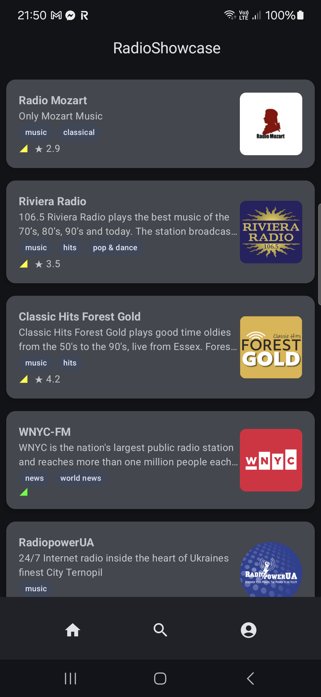
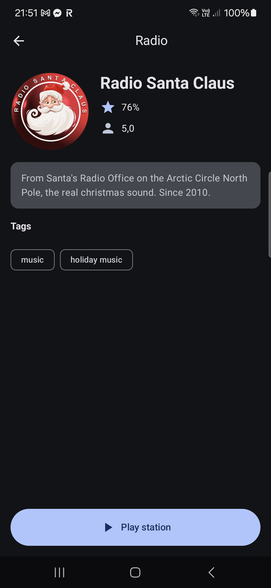
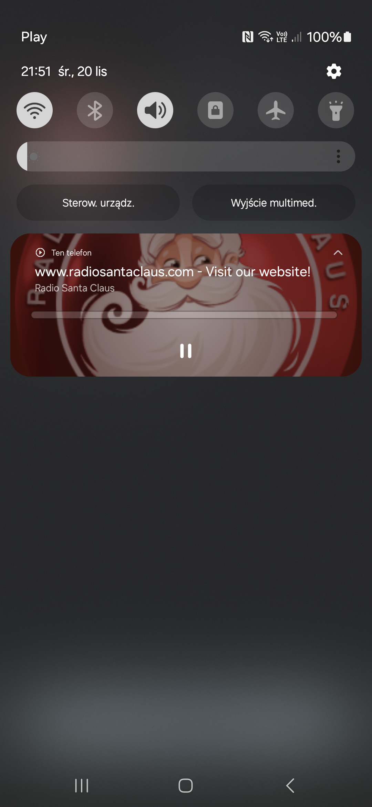

<!-- ABOUT THE PROJECT -->

## Screenshots
 

## About The Project

Take-Home Challenge

Your mission, should you choose to accept, is to create an Android app using the mini station API defined below. Our goal here is to not trick you with a brain teaser, instead, we try to promote a more relaxed, real-world setting that hopefully will allow you to show off your best work!

Instructions
We’ve provided a Mock API endpoint for use during your project:

Create the following required screens:
1. Home Screen
* Display a list of available stations to play. 
* Decide the order and layout of the stations as per your preference.
* Tapping on a station should begin playback of the associated stream and display the Now Playing Screen.

2. Now Playing Screen
* Display information about the currently playing station. 
* The UI here can look however you want. Minimum features should include
* Artwork, Play and Pause, but feel free to add more as you see fit.
* Dismissing the Now Playing screen should not stop audio playback.

## Code Summary
* Jetpack Compose for UX and Navigation
* MVVM as view architecture with adding Screen interface class as entry point to Screen Composables
* Moshi, Retrofit, OkHttp on networking layer
* Koin for Dependency Injection - unit test for graph validation
* Unit Tests for networking and mapper layer - inside Kotlin modules
* Multimodule application - similar to [Google Recommendation](https://developer.android.com/topic/modularization) but slightly modifier
  * custom Android and Java plugins for convenience to share build setup between modules
  * instead core modules there are libs module (lib_network) - plain Kotlin modules
  * instead data modules there is core module (core_home) - plain Kotlin modules
  * feature without change
  * additionally android modules for basic android code sharing
  * additionally component library for complex widgets or android addons like RadioPlayer
* Audio is playing by ExoPlayer with MediaController - module component-radioplayer
  * there is bug inside Android code and I wasted so much time to find solution, finally [IT HELPED](https://stackoverflow.com/questions/74035158/android-media3-session-controller-playback-not-starting/74038824#74038824)
* There is no additionally features because I focused on quality of base scope and run of time to continue with features.

